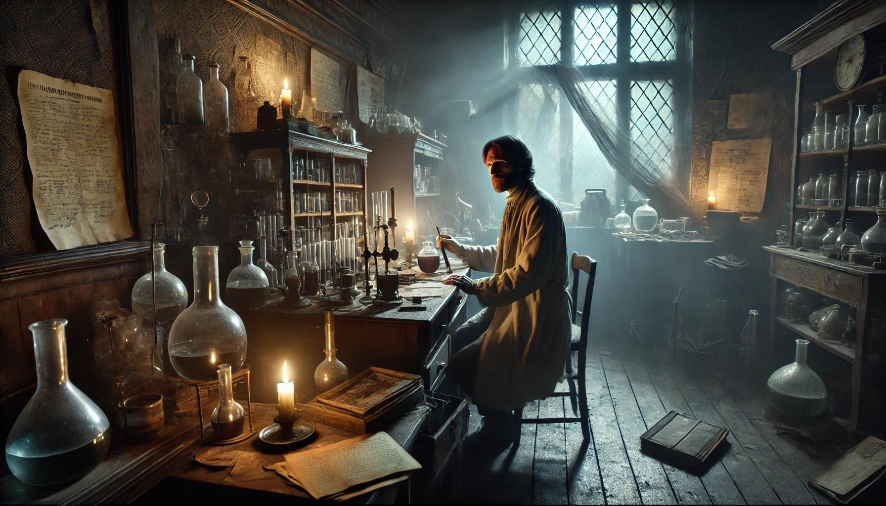
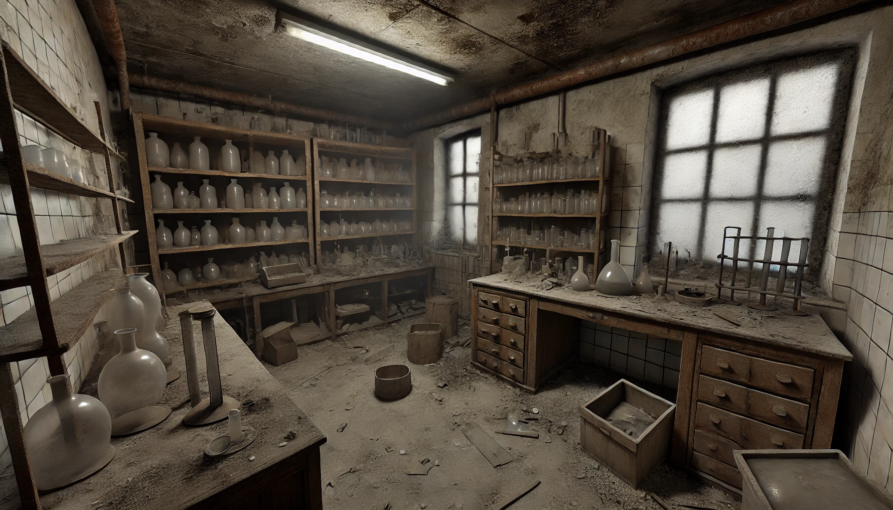
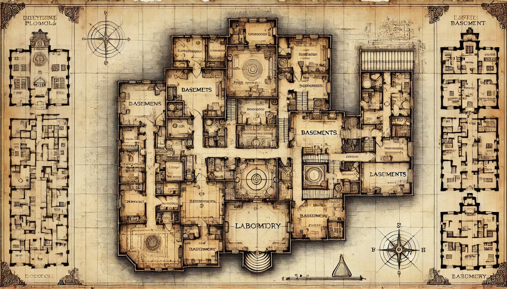
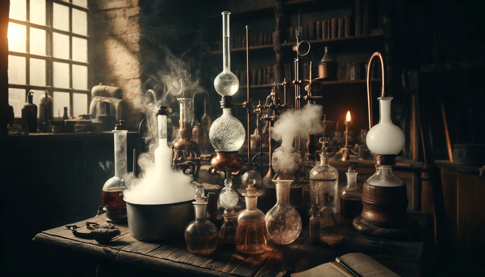
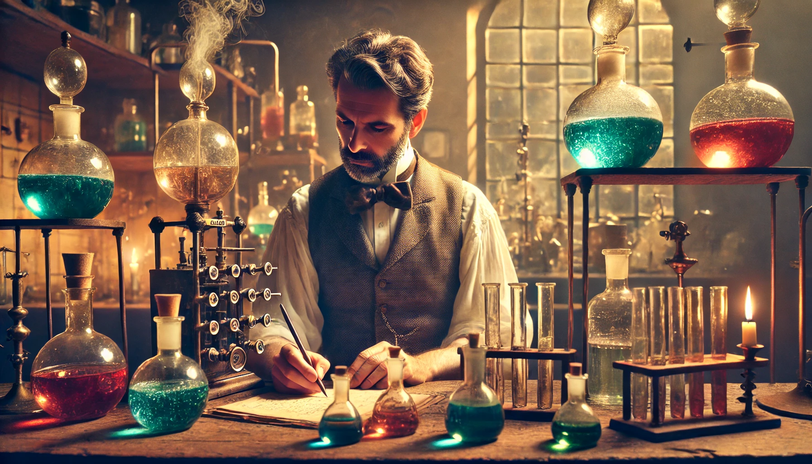
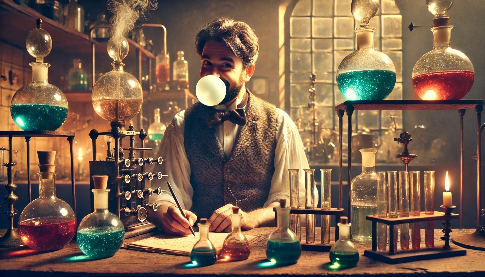

<!--

mode: Presentation

version:  0.0.1

language: de

narrator: Deutsch Male

@style
body {
            font-family: 'Courier New', monospace;
            background-color: #f0e6d2;
            color: #333;
        }

        .lia-slide {
            background-color: #fff9e6;
            border: 1px solid #d3c9a5;
            
            position: relative;
            overflow: hidden;
            filter: sepia(50%);
        }

        h1 {
            color: #8b4513;
            text-shadow: 1px 1px 1px #d3c9a5;
            font-size: 2.5em;
            margin-bottom: 0.5em;
        }

        .lia-slide::after {
            content: "";
            position: absolute;
            top: 0;
            left: 0;
            width: 100%;
            height: 100%;
            box-shadow: 0 0 150px rgba(0,0,0,0.7) inset;
            pointer-events: none;
        }

        .grain {
            position: relative;
        }

        .grain::before {
            content: "";
            position: absolute;
            top: 0;
            left: 0;
            width: 100%;
            height: 100%;
            background-image: 
                repeating-radial-gradient(circle at 50% 50%, transparent 0, rgba(0,0,0,.1) 1px, transparent 2px);
            opacity: 0.3;
            pointer-events: none;
        }

@end

-->

# Tagebuch - Dr. Friedrich Albrecht

    --{{0}}--
Im Jahr 1925, als das Haus noch als Gesundheitsamt genutzt wurde, arbeitete hier ein brillanter und leidenschaftlicher Wissenschaftler namens Dr. Friedrich Albrecht. Dr. Albrecht war bekannt für seine bahnbrechenden Forschungen im Bereich der Medizin und Biologie. Er war davon überzeugt, dass er kurz davor stand, eine Entdeckung zu machen, die die Menschheit revolutionieren würde: ein Heilmittel für eine tödliche Krankheit, die damals viele Menschenleben forderte.
Eines Nachts, kurz vor der Fertigstellung seines Experiments, verschwanden Dr. Albrecht und seine Unterlagen auf mysteriöse Weise. Gerüchte besagen, dass er seine Forschungsergebnisse und das fast vollendete Heilmittel irgendwo im Haus versteckt hat, um sie vor falschen Händen zu schützen. Seither wurde das Gesundheitsamt geschlossen, und das Haus blieb lange Zeit unbewohnt und geheimnisvoll.

    --{{1}}--
Viele Jahre später haben die neuen Bewohner des Hauses beschlossen, dieses Geheimnis zu lüften und Dr. Albrechts verschollenes Experiment zu finden. Es heißt, dass er Hinweise in Form von Rätseln und Aufgaben hinterlassen hat, um sicherzustellen, dass nur die Klügsten und Mutigsten sein Vermächtnis entdecken können.
Nun, da ihr alle jungen Wissenschaftler:innen seid, liegt es an euch, diese Rätsel zu lösen und das verschollene Experiment zu finden. Ihr müsst eure Intelligenz, eure Teamarbeit und euren Forschergeist einsetzen, um die versteckten Hinweise zu entschlüsseln und den wertvollen Schatz zu finden, der seit fast einem Jahrhundert verborgen ist.

      {{1}}

## Eure Mission

    --{{0}}--
Ihr werdet durch verschiedene Räume und Stationen des Hauses geführt, jedes mit einer speziellen Herausforderung, die Dr. Albrecht hinterlassen hat. Euer Ziel ist es, alle Rätsel zu lösen, die Hinweise zu sammeln und schließlich das versteckte Experiment zu finden, um Dr. Albrechts Werk zu vollenden und das Heilmittel ans Licht zu bringen.
Seid mutig, bleibt neugierig und vertraut auf eure Fähigkeiten. Das Geheimnis von Dr. Friedrich Albrecht wartet darauf, von euch entdeckt zu werden!

### 1. Das Chemie-Labor

    --{{0}}--
Die 1. Station führt euch in das geheime Chemie-Labor im Keller des Hauses. Dr. Friedrich Albrecht hat hier viele chemische Experimente durchgeführt, um sein Heilmittel zu entwickeln. Am Ende hat er immer wieder versucht, die richtige Mischung zu finden, die eine spezielle Reaktion hervorruft.
Im Labor liegen verschiedene Hinweiskarten mit Aufgaben. Wenn ihr diese erfüllt, dann gebe ich euch den Hinweis, wo das nächste Forschungszimmer zu finden ist.

     {{1}}
********************************************

     {{|>}}
Markiert welche Reaktionen ihr beobachtet habt?

-[ ] Jede\*r aus der Gruppe hat einmal eine Flüssigkeit in eine andere gekippt.
-[ ] Es ist eine neue Farbe entstanden.
-[ ] Es hat sich Schaum gebildet!

*******************************************

### 2. Rätsel von Professor Bauer

    --{{0}}--
Richtig! Ihr habt alle Aufgaben erfüllt.
Ihr habt den ersten Schritt auf dem Weg zur Entdeckung meines großen Geheimnisses erfolgreich gemeistert. Doch nun steht euch eine weitere Herausforderung bevor. In diesem Haus arbeitete auch mein geschätzter Kollege, Professor Heinrich Bauer, ein brillanter Mathematiker. Er war dafür bekannt, dass er seine wertvollsten Erkenntnisse in Zahlenrätseln verschlüsselte, um sie vor neugierigen Augen zu schützen.
Um den nächsten Hinweis zu finden und eure Reise fortzusetzen, müsst ihr die Zahlenschlossbox öffnen, die ich draußen im Innenhof des Hauses versteckt habe. In dieser Box befindet sich der nächste entscheidende Hinweis zu meinem Experiment. Professor Bauer hat vier mathematische Rätsel hinterlassen, deren Lösungen euch die Zahlenkombination verraten werden.
Denkt scharf nach und nutzt euren Verstand, um die Rätsel zu lösen. Jedes Rätsel steht für eine Zahl des Schlosses. Kombiniert die vier Zahlen in der richtigen Reihenfolge, um das Schloss zu öffnen und den nächsten Hinweis zu erhalten.

1. Addiere die Anzahl der Beine einer Spinne mit der Anzahl der Augen eines Würfels und teile das Ergebnis durch 7.

   <!-- data-solution-button="off" -->
   [[2]]

2. Multipliziere die Anzahl der Tage einer Woche mit 1.

   <!-- data-solution-button="off" -->
   [[7]]

3. Subtrahiere die Anzahl der Planeten im Sonnensystem von der Anzahl der Monate im Jahr.

   <!-- data-solution-button="off" -->
   [[4]]

4. Addiere die Anzahl der Stunden auf einer analogen Uhr mit der Anzahl der Seiten eines Würfels und subtrahiere die Anzahl der Finger an einer Hand mal 2.

   <!-- data-solution-button="off" -->
   [[8]]
   *************************

   Und jetzt findet die Box im Innenhof und öffnet das Zahlenschloss. Dann kriegt ihr die nächste Aufgabe.

   *************************

### 3. Garten

    --{{0}}--
Liebe junge Wissenschaftler:innen,
Ihr habt bewiesen, dass ihr scharfsinnige Denker seid. Nun ist es an der Zeit, eure körperliche Geschicklichkeit und eure Teamarbeit unter Beweis zu stellen. Ihr seid im Garten, wo Professor Albrecht oft spazieren ging und nach Inspiration suchte. Dort hat er eine besondere Herausforderung für euch hinterlassen.
Im Garten müsst ihr eine Reihe von Bewegungsaufgaben absolvieren, um den nächsten Hinweis zu finden. 

      {{1}}
**********************************************************

Habt ihr eure Geschicklichkeit und Beweglichkeit bewiesen?

- [(X)] Ja ...
- [( )] Wir bewegen uns nicht gern, braucht man das wirklich?
- [( )] Nein, es war zu schwer

**********************************************************

### 4. Physik

    --{{0}}--
Liebe junge Wissenschaftler:innen,
Ihr habt euch bisher hervorragend geschlagen. Nun müsst ihr eure Kenntnisse in der Physik unter Beweis stellen. Im Physiklabor wartet eine Herausforderung auf euch, die ich selbst für besonders knifflig halte. Diese Aufgabe wird eure Fähigkeiten in der Physik und euer Verständnis für die Kräfte der Natur auf die Probe stellen.
Im Physiklabor müsst ihr eine Rube-Goldberg-Maschine bauen, um den nächsten Hinweis zu enthüllen. Eine Rube-Goldberg-Maschine ist eine komplizierte Vorrichtung, die eine einfache Aufgabe auf übertrieben komplizierte Weise ausführt. Am Pflaumenbaum hängt ein Beutel. Darin findet ihr verschiedene Materialien und Gegenstände, die ihr verwenden könnt, um eine Kettenreaktion zu erzeugen. Am Ende müsst ihr es schaffen, den Becher umzustoßen.
Seid kreativ und arbeitet zusammen, um die Maschine zu bauen. Jeder Schritt muss sorgfältig geplant und ausgeführt werden, damit die Kettenreaktion erfolgreich ist. Sobald die Maschine funktioniert und der Becher umgekippt ist, werdet ihr den entscheidenden Hinweis bekommen, wo sich die geheimen Unterlagen befinden! Der Schatz!
Viel Erfolg und habt Spaß beim Bau eurer Rube-Goldberg-Maschine!
Euer Dr. Friedrich Albrecht

!?

### "Die unerwartete Entdeckung"

    --{{0}}--
Dr. Friedrich Albrecht arbeitete unermüdlich an der Entwicklung eines Heilmittels gegen eine tödliche Krankheit. Tag und Nacht verbrachte er in seinem Labor, mischte geheimnisvolle Zutaten und führte Experimente durch. Die Wände des alten Gesundheitsamtes erzitterten förmlich unter der Last seiner brillanten Ideen.
Eines Abends, als er wieder tief in seine Arbeit vertieft war, passierte etwas Seltsames. Während er verschiedene pflanzliche Extrakte und Harze zusammenmischte, um die perfekte Formel für das Heilmittel zu finden, bildete sich plötzlich eine zähe, klebrige Masse in seinem Reagenzglas. Zunächst dachte er, es sei ein Fehler – seine Berechnungen waren doch präzise! Doch als er die Masse in die Hand nahm und daran roch, bemerkte er einen angenehmen, süßen Duft.

    {{0-1}}

    --{{1}}--
Dr. Albrecht, neugierig wie immer, entschied sich, ein kleines Stück von dieser zähen Masse zu probieren. Überraschenderweise war sie weich, dehnbar und – obwohl sie keinen medizinischen Nutzen hatte – schmeckte sie köstlich! Während er nachdenklich auf dem neuen Stoff herumkaute, merkte er, dass er etwas ganz anderes entdeckt hatte: den Kaugummi!
Er schrieb in sein Notizbuch: „Kein Heilmittel, aber etwas, das den Menschen Freude bringen wird.“ Und tatsächlich war sein „Fehler“ eine Erfindung, die die Welt nicht nur zum Lächeln, sondern auch zum Kauen brachte!
Seine Entdeckung blieb lange ein Geheimnis, bis heute – denn ihr, die tapferen Entdecker, habt nun das Rezept gefunden, um Dr. Albrechts legendären Kaugummi selbst herzustellen!

    {{1}}

